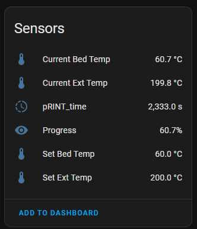

#ESPHome - Marlin2
### A component that reads Marlin status and messages from the uart.


A configured uart is required.

Example:
```yaml

marlin2:
  uart_id: uart_bus

switch:
  - platform: restart
    name: "Restart Printer"

sensor:
  - platform: marlin2
    bed_temperature:
      name: Current Bed Temp
    bed_set_temperature:
      name: Set Bed Temp
    ext_temperature:
      name: Current Ext Temp
    ext_set_temperature:
      name: Set Ext Temp
    print_progress:
      name: Progress
    print_time:
      name: "pRINT_time"
    print_time_remaining:
      name: "pRINT_time_remaining"

text_sensor:
  - platform: marlin2
    printer_state:
      name: status
```

Notes:
* https://github.com/ssieb/esphome_components/tree/master/components/serial_csv
* https://github.com/esphome/esphome/blob/dev/esphome/components/dht/sensor.py#L34
* https://github.com/mulcmu/esphome-marlin-uart
* https://github.com/oxan/esphome-stream-server/blob/master/components/stream_server/stream_server.cpp

Full COnfiguration:
```yaml
esphome:
  name: vasek-ender-3
  friendly_name: vasek-ender-3

external_components:
  - source: components
  
esp8266:
  board: esp01_1m

logger:
  baud_rate: 0
  esp8266_store_log_strings_in_flash: False
  
# Enable Home Assistant API
api:
  encryption:
    key: "="

ota:
  - platform: esphome
    password: ""

wifi:
  ssid: !secret wifi_ssid
  password: !secret wifi_password
  
  # Enable fallback hotspot (captive portal) in case wifi connection fails
  ap:
    ssid: "Vasek-Ender-3 Fallback Hotspot"
    password: ""

web_server:
  port: 80
  version: 3
  
uart:
  id: uart_bus
  tx_pin: GPIO1
  rx_pin: GPIO3
  baud_rate: 115200

marlin2:
  uart_id: uart_bus

switch:
  - platform: restart
    name: "Restart Printer"

sensor:
  - platform: uptime
    type: seconds
    name: Uptime Sensor

  - platform: marlin2
    bed_temperature:
      name: Current Bed Temp
    bed_set_temperature:
      name: Set Bed Temp
    ext_temperature:
      name: Current Ext Temp
    ext_set_temperature:
      name: Set Ext Temp
    print_progress:
      name: Progress
    print_time:
      name: "pRINT_time"
    print_time_remaining:
      name: "pRINT_time_remaining"

text_sensor:
  - platform: marlin2
    printer_state:
      name: status
```